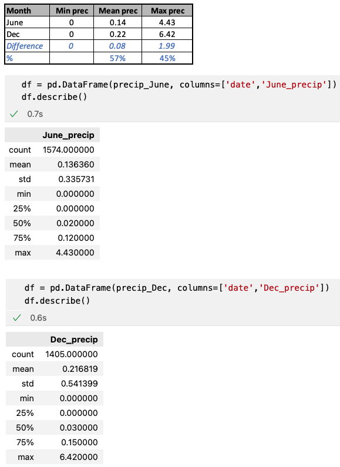

# Surfs_up, Module 9 Challenge

The purpose of this challenge is to import information from a database using sqlalchemy and then arranging the data into tuples, lists or dataframes, as needed for analysis.

## Deliverable 1

Query to retrieve June temperatures from the Measurement table.

The temperatures are added to a list.

​The list of temperatures is converted to a Pandas DataFrame.

Summary statistics are generated for the DataFrame.

## Deliverable 2

Query to retrieve December temperatures from the Measurement table.

The temperatures are added to a list.

​The list of temperatures is converted to a Pandas DataFrame.

Summary statistics are generated for the DataFrame.

## Deliverable 3: Analysis

### Overview of the statistical analysis

Based on data collected by different weather stations, the temperature for June and December were filtered for analysis, 1,574 and 1,405 values respectively.

Additionally, the precipitation was filtered for the same periods for further evaluation.

### Results

Hereafter are the key differences in temperature, between the months of June and December.

* From the above image (31.png), it is clear that in all analyzed categories, the temperature in June is higher than in December.

* The largest difference is the minimum temperature, 8 degrees Fahrenheit. This happens around sunrise (7 AM). Ref: https://www.globe.gov/explore-science/scientists-blog/archived-posts/sciblog/2008/02/27/how-the-temperature-varies-during-the-day-and-night/comment-page-1/index.html

* On the other hand, the maximum temperature difference is just 2 degrees Fahrenheit, which is realistically unnoticed by the human body. This normally happens around 4 PM (same reference as above).

### Additional Information

The precipitation data for June and December was also gathered, in the above image (32.png) it can be seen that December has about 50% more rain compared to June.